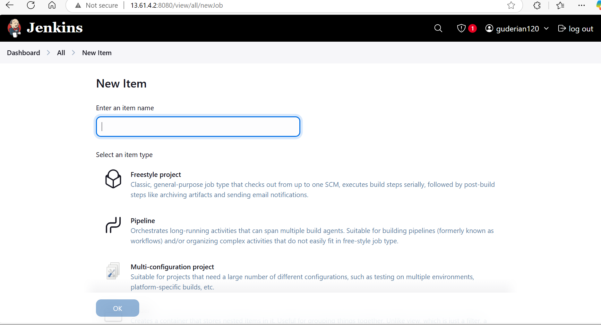

# Jenkins CI/CD Pipeline with Maven, GitHub, and Tomcat

This guide documents the setup and deployment process of a CI/CD pipeline using Jenkins, Maven, GitHub, and Tomcat. It also covers the configuration of a Jenkins master-slave architecture for distributed builds.

---

## 📦 Prerequisites

- AWS EC2 instance (Ubuntu preferred)
- Open port `8080` in the EC2 security group
- GitHub repository with a Maven Java application
- Apache Tomcat installed on a target deployment server


---

## 🚀 Jenkins CI/CD Setup

### 1. Install Java on EC2

```bash
sudo apt update
sudo apt install default-jre
```

Set environment variables:

```bash
export JAVA_HOME=$(dirname $(dirname $(readlink -f $(which java))))
export PATH=$PATH:$JAVA_HOME
```

To make it permanent, add the above to `~/.bash_profile`.

---

### 2. Install Jenkins

```bash
wget -O /usr/share/keyrings/jenkins-keyring.asc https://pkg.jenkins.io/debian-stable/jenkins.io-2023.key

echo "deb [signed-by=/usr/share/keyrings/jenkins-keyring.asc] https://pkg.jenkins.io/debian-stable binary/" | sudo tee /etc/apt/sources.list.d/jenkins.list > /dev/null

sudo apt update
sudo apt install jenkins
sudo systemctl start jenkins
```

- Access Jenkins at `http://<your-ec2-ip>:8080`
- Retrieve the initial admin password:
  ```bash
  sudo cat /var/lib/jenkins/secrets/initialAdminPassword
  ```

- Install suggested plugins and set up admin credentials

---

## 🔧 Configuring Jenkins Jobs

### 1. Create a Freestyle Job

- Go to **New Item** → name your job → select **Freestyle Project**
- Under **Source Code Management**, select **Git**
- Paste your GitHub repository URL
- If Git is not found:
  ```bash
  sudo apt install git
  which git
  ```
  
  - Then go to: `Manage Jenkins > Global Tool Configuration > Git` and paste the path

### 2. Build with Maven

- Under **Build > Build Step**, select **Invoke top-level Maven targets**
- Set goals:
  ```bash
  clean package
  ```

### 3. Post-Build Actions: Deploy to Tomcat

- Add post-build action: **Deploy war/ear to a container**
- WAR file path: 
  ```
  **/target/*.war
  ```
- Select container type: **Tomcat (version)**
- Add credentials and Tomcat server URL

---

## 🔁 Automate Builds with Git Polling

- Go to your job → **Configure**
- Under **Build Triggers**, select **Poll SCM**
- Cron syntax for polling every minute:
  ```cron
  * * * * *
  ```

---

## 🧱 Setting Up Jenkins Master-Slave

To distribute workloads, you can set up a Jenkins slave (agent) for builds.

### 1. Configure Node in Jenkins

- Go to **Manage Jenkins > Manage Nodes and Clouds > New Node**
- Name: `linux_node`
- Set:
  - Description
  - Number of executors
  - Remote root directory (e.g. `/home/ubuntu/jenkins-agent`)
  - Labels for job targeting
  - Usage: "Use this node as much as possible"
  - Launch method: "Launch agent by connecting to the master"

### 2. Connect the Agent

On the slave server, run:

```bash
curl -sO http://<jenkins_ip>:8080/jnlpJars/agent.jar

java -jar agent.jar \
  -url http://<jenkins_ip>:8080/ \
  -secret <secret_from_jenkins> \
  -name "linux_node" \
  -webSocket \
  -workDir "/home/ubuntu/jenkins-agent"
```

---

## 🛠️ Cronjob to Keep Agent Alive

Use a cronjob to ensure the agent restarts if it stops:

```cron
* * * * * pgrep -f "slave.sh" > /dev/null || /home/ubuntu/opt/slave.sh >> /var/log/jenkins-slave.log 2>&1
```

> `slave.sh` contains the command to run the Jenkins agent.

---

## 🧪 Creating Jobs on the Slave

- When creating a new job:
  - Check **Restrict where this project can be run**
  - Use the label of your slave node

---

### Jenkin Console Output


## 🧩 Project Example

A simple Java web application built using Maven archetype:
```
mvn archetype:generate -DgroupId=com.example -DartifactId=simpleWebApp ...
```

This app was used to demonstrate the end-to-end Jenkins CI/CD integration.

---

## 🏁 Conclusion


```
